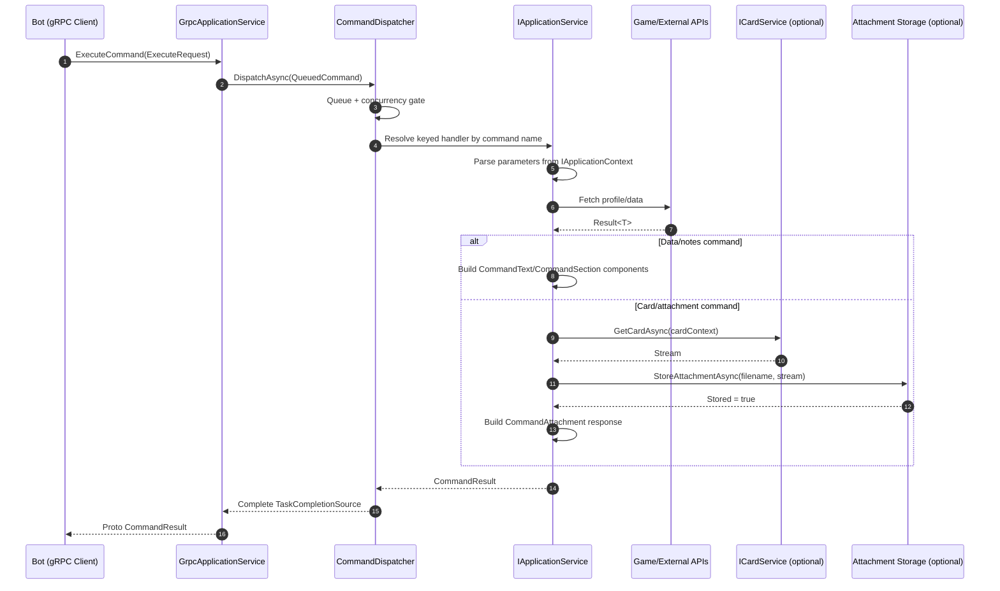

# Application Service Guide

This document explains how to implement command handlers in `Mehrak.Application`.

References used in this guide:

- `Mehrak.Application/Services/Genshin/Character/GenshinCharacterApplicationService.cs`
- `Mehrak.Application/Services/Genshin/RealTimeNotes/GenshinRealTimeNotesApplicationService.cs`
- `Mehrak.Application/Services/Common/BaseApplicationService.cs`

## What An Application Service Is

An application service is a command handler that implements:

```csharp
Task<CommandResult> ExecuteAsync(IApplicationContext context)
```

Interface:

- `Mehrak.Application/Services/Abstractions/IApplicationService.cs`

It receives a normalized request from `CommandDispatcher`, runs business logic (API calls, data processing, optional card generation), and returns a `CommandResult` that the bot can render/send.

## Request Lifecycle

1. Bot sends gRPC `ExecuteRequest` (with command name + parameters).
2. `GrpcApplicationService` wraps request in `QueuedCommand`.
3. `CommandDispatcher` dequeues and resolves keyed `IApplicationService` using command name.
4. Service executes `ExecuteAsync(context)`.
5. Result is returned through gRPC back to bot.

Important: command name is the routing contract. If the key is missing from DI registration, dispatcher returns "No service registered".

### Sequence Diagram



## Service Base Classes

### `BaseApplicationService`

Use this for commands that return text/sections/attachments and do not need attachment storage helpers.

Provided helpers:

- `GetGameProfileAsync(...)`: resolves active game profile via GameRole API
- `UpdateGameUidAsync(...)`: stores latest resolved game UID for profile/server

Typical users:

- `GenshinRealTimeNotesApplicationService`

### `BaseAttachmentApplicationService`

Use this for image/card commands that store generated files in attachment storage.

Additional helpers:

- `GetFileName(serializedData, extension, gameUid)`: deterministic SHA256 filename
- `AttachmentExistsAsync(storageFileName)`: storage cache check
- `StoreAttachmentAsync(userId, storageFileName, stream)`: persist generated output

Typical users:

- `GenshinCharacterApplicationService`

## `IApplicationContext` Contract

Source:

- `Mehrak.Application/Services/Abstractions/IApplicationContext.cs`

Available fields:

- `UserId`
- `LtUid`
- `LToken`
- `GetParameter(string key)`

The context parameters must match bot-side keys exactly (for example `"server"`, `"character"`, `"game"`, `"mode"`).

## Result Model (`CommandResult`)

Source:

- `Mehrak.Domain/Models/CommandResult.cs`

Return patterns:

- `CommandResult.Success(...)` for successful execution
- `CommandResult.Failure(CommandFailureReason, message)` for failures

Supported output building blocks:

- `CommandText`
- `CommandAttachment`
- `CommandSection`

Attachment source types:

- `AttachmentSourceType.AttachmentStorage`: generated files uploaded by app service
- `AttachmentSourceType.ImageStorage`: static assets from image repository

## Implementation Pattern A: Data/Section Command

Reference: `GenshinRealTimeNotesApplicationService`

Use this for commands that mainly fetch API data and return rich text/section components.

Flow:

1. Parse required parameters from `context`.
2. Resolve server to region.
3. Fetch game profile using `GetGameProfileAsync(...)`.
4. Return `AuthError` if profile is not available.
5. Update stored game UID via `UpdateGameUidAsync(...)`.
6. Call domain API service (for example notes endpoint).
7. Transform API data into `CommandText` + `CommandSection` components.
8. Return `CommandResult.Success(...)`.

Minimal skeleton:

```csharp
internal class ExampleNotesApplicationService : BaseApplicationService
{
	public override async Task<CommandResult> ExecuteAsync(IApplicationContext context)
	{
		try
		{
			var server = Enum.Parse<Server>(context.GetParameter("server")!);
			var region = server.ToRegion();

			var profile = await GetGameProfileAsync(context.UserId, context.LtUid, context.LToken, Game.Genshin, region);
			if (profile == null)
				return CommandResult.Failure(CommandFailureReason.AuthError, ResponseMessage.AuthError);

			await UpdateGameUidAsync(context.UserId, context.LtUid, Game.Genshin, profile.GameUid, server.ToString());

			// Call API, map data to components.
			return CommandResult.Success([new CommandText("...")], isContainer: true, isEphemeral: true);
		}
		catch (Exception)
		{
			return CommandResult.Failure(CommandFailureReason.Unknown, ResponseMessage.UnknownError);
		}
	}
}
```

## Implementation Pattern B: Card/Attachment Command

Reference: `GenshinCharacterApplicationService`

Use this when command output is generated media (for example character card).

Flow:

1. Parse and validate user input (max counts, aliases, etc.).
2. Resolve profile and update game UID.
3. Fetch source data from Game API.
4. Ensure required image assets exist (optionally fetch/update missing assets).
5. Generate deterministic filename from payload (`GetFileName(...)`).
6. Short-circuit if attachment already exists (`AttachmentExistsAsync(...)`).
7. Render card using `ICardService<T>.GetCardAsync(...)`.
8. Store file via `StoreAttachmentAsync(...)`.
9. Return `CommandAttachment` references in success result.

Card generation context helper:

- `BaseCardGenerationContext<T>` can carry user id, payload, game profile, and optional renderer parameters (for example ascension cap).

Minimal skeleton:

```csharp
internal class ExampleCardApplicationService : BaseAttachmentApplicationService
{
	public override async Task<CommandResult> ExecuteAsync(IApplicationContext context)
	{
		// Fetch + validate data.
		// Compute file name from deterministic payload.
		// Generate and store card if missing.

		return CommandResult.Success([
			new CommandAttachment("<filename>.jpg", AttachmentSourceType.AttachmentStorage)
		]);
	}
}
```

## Registration and Wiring Checklist

For every new application service:

1. Add/update command key in `Mehrak.Domain/Common/CommandName.cs`.
2. Register keyed handler in app DI:
   - Common: `Mehrak.Application/ApplicationServiceCollectionExtension.cs`
   - Game-specific: `Services/<Game>/<Game>ApplicationServiceExtensions.cs`
3. If card command:
   - Register `ICardService<TData>` implementation
   - Register async initialization if renderer preloads assets
4. Ensure bot module dispatches the same command key.

Example keyed registration:

```csharp
services.AddKeyedTransient<IApplicationService, GenshinCharacterApplicationService>(CommandName.Genshin.Character);
```

## Error Handling Conventions

Use consistent failure mapping:

- Auth/identity issues: `CommandFailureReason.AuthError`
- External API/data issues: `CommandFailureReason.ApiError`
- Internal processing/card generation issues: `CommandFailureReason.BotError`
- Unexpected uncaught exceptions: `CommandFailureReason.Unknown`

Recommended structure:

- Validate early and return clear user-safe messages.
- Log full technical context (`userId`, command scope, API result).
- Catch broad exceptions at service boundary and return stable fallback response.

## Performance and Reliability Notes

- Prefer batching/concurrent IO where safe (`Task.WhenAll`) for image updates and external calls.
- Reuse deterministic filenames and existence checks to avoid regenerating identical cards.
- Keep API failure handling partial where possible (for multi-entity requests) so one failure does not cancel all output.
- Respect cancellation where possible if adding long-running operations.

## Common Contributor Pitfalls

- Bot command key and app keyed registration do not match.
- Parameter names differ between bot module and `context.GetParameter(...)` usage.
- Card service registered but not initialized for preload-dependent assets.
- Returning attachment with wrong `AttachmentSourceType`.
- Returning raw exception messages to users instead of safe response messages.
