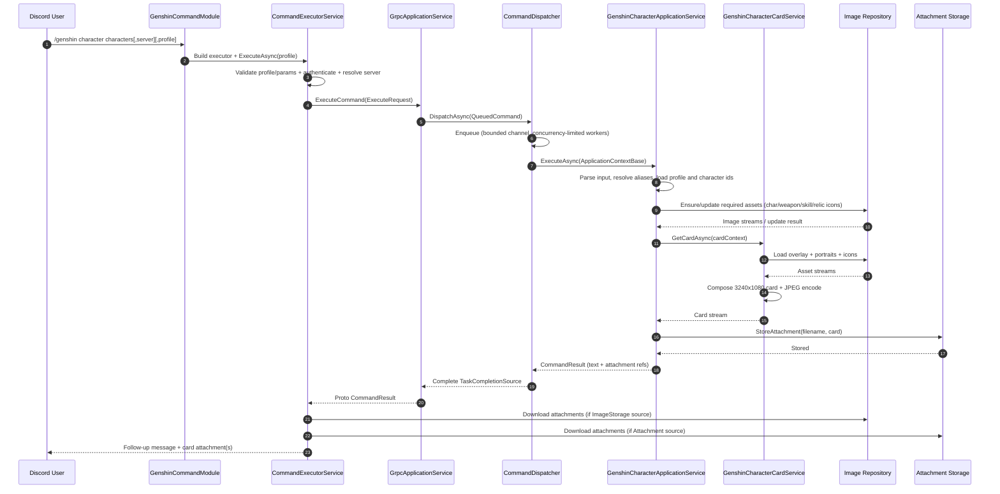

# Code Architecture

The code is separated into two main categories:

- Common: The common libraries, interfaces to be used by services
- Services: The main logic where user interaction, execution happens

### Common

The Common category has three layers:

- `Mehrak.Domain`: Responsible for service abstraction, models, DTOs
- `Mehrak.GameApi`: A wrapper for HoYoLAB API
- `Mehrak.Infrastructure`: Abstraction and classes to access infrastructure services, eg. DB, Redis, Object Storage etc.

### Services

The Services category has three layers:

- `Mehrak.Application`: An internal gRPC service responsible for the bulk of logic execution
- `Mehrak.Bot`: The Discord Bot user entry point
- `Mehrak.Dashboard`: A WebApi backend service for the Dashboard site

## Execution Overview

Execution starts from an entry point (Bot or Dashboard). The caller validates inputs/auth, then dispatches a command to the Application service over gRPC with:

- Discord User Id: `ulong`
- LtUid: `ulong`
- LToken: `string`
- Command Name: `string`
- Command Parameters: `Dictionary<string, string>`

The Application service enqueues the request, resolves the keyed `IApplicationService`, builds an `IApplicationContext`, executes business logic, and returns a `CommandResult`. For image commands, the application layer generates a card image, stores it, and returns attachment metadata to the caller.

## Sample Execution Path: `/genshin character`

The following path documents the concrete execution flow across the files below:

- `Mehrak.Bot/Modules/GenshinCommandModule.cs`
- `Mehrak.Bot/Services/CommandExecutorService.cs`
- `Mehrak.Application/Services/GrpcApplicationService.cs`
- `Mehrak.Application/Services/CommandDispatcher.cs`
- `Mehrak.Application/Services/Genshin/Character/GenshinCharacterApplicationService.cs`
- `Mehrak.Application/Services/Genshin/Character/GenshinCharacterCardService.cs`

### Sequence Diagram

### 1. Discord command intake (Bot layer)

`GenshinCommandModule.CharacterCommand(...)`:

- Receives slash command parameters: `characters`, optional `server`, optional `profile`
- Adds command parameters including `game = Game.Genshin`
- Sets command key to `CommandName.Genshin.Character`
- Adds basic validator (`characters` must be non-empty)
- Builds an executor and calls `ExecuteAsync(profile)`

### 2. Authentication, validation, and dispatch preparation

`CommandExecutorService.ExecuteAsync(profile)`:

- Validates profile range (`1..10`) and custom validators
- Runs authentication middleware to resolve HoYo credentials
- Resolves or persists server when `ValidateServer == true`
- Calls `DispatchCommand(...)` (defined in `CommandExecutorServiceBase`), which maps data into protobuf `ExecuteRequest` and sends gRPC request via `ApplicationServiceClient.ExecuteCommandAsync(...)`

### 3. gRPC ingress in Application service

`GrpcApplicationService.ExecuteCommand(...)`:

- Creates `TaskCompletionSource<CommandResult>` with `RunContinuationsAsynchronously`
- Wraps request into `QueuedCommand` (request + TCS + cancellation token)
- Enqueues via `CommandDispatcher.DispatchAsync(...)`
- Awaits TCS result and converts domain result to protobuf

### 4. Queueing and controlled concurrency

`CommandDispatcher`:

- Uses a bounded channel (`capacity = 100`, `DropWrite` on overflow)
- Uses `SemaphoreSlim(MaxConcurrency)` to limit parallel processing
- For each queued item:
  - Creates a DI scope
  - Builds `ApplicationContextBase` from request data
  - Resolves keyed `IApplicationService` by command name
  - Executes service and completes the TCS
- On exceptions, logs and faults the TCS

This design decouples request ingestion from execution and provides backpressure under high load.

### 5. Character command business logic

`GenshinCharacterApplicationService.ExecuteAsync(...)`:

- Parses `server` and split `character` input (max 4 per request)
- Retrieves game profile and updates stored game UID/server history
- Calls character API:
  - List endpoint for available characters
  - Detail endpoint for selected character IDs
- Resolves aliases and accumulates per-character failures without aborting the full request
- For each character detail, calls `ProcessCharacterAsync(...)`

`ProcessCharacterAsync(...)`:

- Computes deterministic output filename (based on serialized payload)
- Returns cached attachment immediately if file already exists
- Ensures all required assets exist in object storage:
  - Character portrait (via wiki fallback when missing)
  - Weapon icons (including ascended/catalyst handling)
  - Constellation, skill, and relic icons (resized/preprocessed)
- Applies image update tasks concurrently and validates completion
- Retrieves ascension cap data and sets generation context parameters
- Calls card renderer: `m_CardService.GetCardAsync(...)`
- Stores generated image in attachment storage
- Tracks metrics and returns filename

### 6. Card rendering

`GenshinCharacterCardService.GetCardAsync(...)`:

- Loads overlay, character portrait, weapon, constellation, skill, and relic slot images
- Applies constellation effects to skill metadata when relevant
- Calculates active relic sets and displayable stats
- Composes final card on a `3240x1080` canvas with:
  - Element-themed background color
  - Character portrait and identity text
  - Skills, constellations, weapon block, stats, relic blocks, set summary
- Encodes as JPEG and returns stream
- Disposes all temporary image resources in `finally`

### 7. Response assembly back in Bot

`CommandExecutorService.ExecuteAsync(...)` receives `CommandResult`:

- Converts components to Discord message payload
- Resolves attachments from either:
  - image repository (`AttachmentSourceType.ImageStorage`)
  - attachment storage bucket
- Sends follow-up response:
  - Ephemeral when command/result requires it
  - Otherwise sends completion text + message with card attachment and Remove button
- Disposes downloaded streams after send

## Error Handling and Resilience

- Validation/auth failures are returned early with user-friendly messages.
- API/image failures are logged and transformed into typed failure reasons.
- Character batch processing is partially tolerant: one character can fail while others succeed.
- Dispatcher queue provides overload protection (`DropWrite`) and concurrency control (`SemaphoreSlim`).
- Cancellation tokens propagate from gRPC context to queueing/processing.

## Data Contract Between Bot and Application

Request envelope (`ExecuteRequest`) carries:

- Identity/auth context: Discord user, LTUID, LTOKEN
- Routing key: command name
- Arbitrary parameters map for command-specific data

Response envelope (`CommandResult`) carries:

- Success/failure state and reason
- Text/components
- Attachment references (filename + source type)
- Optional ephemeral message to surface partial failures
